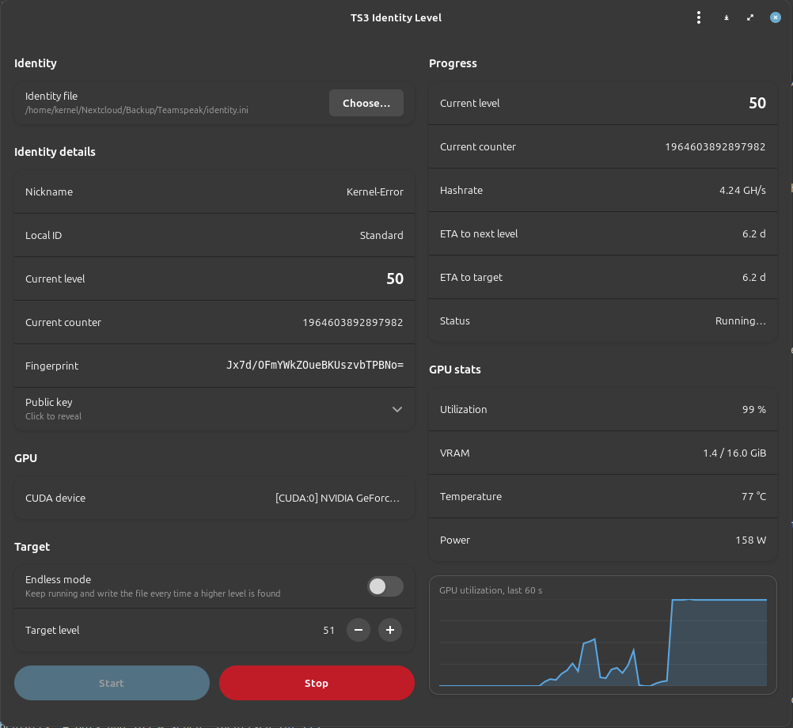

# Usage

The whole workflow is **export → run tool → import**. The TeamSpeak client
never sees this tool; it just produces and consumes a small `.ini` file.

> First time? Read [installation.md](installation.md) first to get the
> NVIDIA driver, GPU device group permissions, and (for the GUI)
> GTK4/libadwaita set up. The tool will refuse to start otherwise and
> tell you exactly which check failed.

## 1. Export the identity from TeamSpeak

Open the TS3 client and go to **Tools → Identities** (or `Self → Identities`).

In the *Synchronized Identities* / *Local Identities* list, **right-click**
the identity you want to raise and pick **Export**. Choose any path on
disk — for example `~/Downloads/myidentity.ini`.

The exported file is a small text `.ini` that looks roughly like:

```ini
[Identity]
id=Standard
identity="115707870633923V…long base64 blob…"
nickname=Your Mum
phonetic_nickname=
```

That file alone is everything this tool needs. **Treat it like an SSH
private key** — it contains your private signing material:

- do not upload it anywhere
- do not paste it into issues, chat, or screenshots
- do not run this tool on files you do not own

While the tool is running, **either close TeamSpeak** or work on an
exported *copy* (not on the original `identities` folder inside TS3's
config). Otherwise the client may overwrite the tool's changes when you
close it.

## 2. Run the tool

### GUI

```bash
ts3level-gui
```



- Click **Choose…** and pick the `.ini` you exported.
- The **Identity details** panel populates immediately: nickname, current
  security level, counter, fingerprint (matches the "Unique ID" the TS3
  client displays), and the public key. Verify the fingerprint matches
  what the client shows so you know you're working on the right
  identity.
- Pick your GPU in the **CUDA device** row.
- Pick a **Target level**, or flip **Endless mode** on to keep grinding
  until you stop it.
- Click **Start**. The progress block on the right updates live
  (hashrate, ETA to next level, ETA to target).

The file on disk is updated every time the tool finds a higher level.
A one-shot backup of the original is kept next to the file as
`*.ini.bak`.

### CLI

```bash
# What devices does the tool see?
ts3level --list-devices

# Run to a target level
ts3level --target 55 ~/Downloads/myidentity.ini

# Run forever (Ctrl-C to stop)
ts3level ~/Downloads/myidentity.ini

# Pick a specific device
ts3level --device 1 --target 55 ~/Downloads/myidentity.ini
```

## 3. Import the result back into TeamSpeak

Back in the TS3 client, open **Tools → Identities** again, **right-click**
in the identity list and pick **Import** — select the same `.ini` file
you exported. The client now shows the higher Security Level.

If TS3 says "this identity already exists", it usually still imports it
under a new name; you can then delete the old version and rename the new
one.

## Tips

- **Realistic expectations:** each level doubles the expected work.
  Going from level 50 to 51 takes as long as going from 1 to 51 in
  total. The GUI's "ETA to next level" is a statistical mean, real
  wait time is exponentially distributed (you can be lucky or unlucky
  by 2× either way).
- **Targets above ~60** start being measured in days even on fast
  cards. Server-side bonuses cap out long before that anyway; there is
  no practical security gain from very high levels.
- **GPU is busy:** the kernel pegs the GPU. If you also want to game
  or run other GPU workloads, stop the tool first.
- **`.bak`:** kept once, never overwritten. If you mess up, copy the
  `.bak` back into place and re-import.
